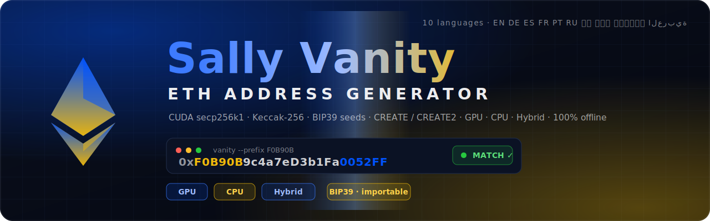

<p align="center">
  
</p>

<p align="center">
  <b>Fast, local Ethereum vanity-address generator.</b><br>
  CUDA secp256k1 + Keccak-256 from scratch · BIP39 seed phrases · CREATE / CREATE2 · GPU · CPU · Hybrid · 100% offline.
</p>

<p align="center">
  
  
</p>
<p align="center">
  
  
  
  
</p>

> ⚠️ **Whoever holds the private key / mnemonic controls the address.** Keep results secret, never paste them into a website. This tool runs fully offline and sends nothing anywhere. → [Security & Privacy](docs/SECURITY.md)

---

## ✨ What it does

Generate Ethereum addresses that **start or end with the characters you want** — `0xdead…`, `0x…beef`, your initials, anything in hex. It does this locally on your **GPU** (very fast) or **CPU** (works everywhere), and can return the result either as a raw private key **or as a 12/24-word seed phrase** you can import straight into MetaMask, SafePal, Trezor, etc.

| Axis | Options |
|------|---------|
| **Key source** | `raw` private key (fast) · **BIP39 seed** 12 / 24 words (importable into any wallet) |
| **Passphrase** | optional BIP39 passphrase (SafePal “hidden wallet” / 25th word) — empty = normal, set = the vanity applies **only** with that passphrase |
| **Match target** | wallet **address** · **CREATE** contract (deployer + nonce, with optional **nonce range**) · **CREATE2** (sender + salt + init code, EIP-1014) |
| **Backend** | **GPU** (CUDA) · **CPU** (multi-threaded) · **Hybrid** (both at once — see below) |
| **UI languages** | English · Deutsch · Español · Français · Português · Русский · 中文 · 日本語 · हिन्दी · العربية (10) |
| **Design** | fixed Base-blue + Binance-yellow mix, frameless native window |

---

## ⬇️ Install (for everyone)

### Option A — download a release (no compiler needed for the CPU build)

1. Go to the [**Releases**](../../releases) page and download the `.zip` for your system:

   | System | File |
   |--------|------|
   | Linux (Intel/AMD) | `sally-vanity-eth-linux-x86_64.zip` |
   | Linux (CUDA GPU)  | `sally-vanity-eth-linux-x86_64-cuda.zip` |
   | macOS (Intel)     | `sally-vanity-eth-macos-x86_64.zip` |
   | macOS (Apple Silicon) | `sally-vanity-eth-macos-arm64.zip` |
   | Windows           | `sally-vanity-eth-windows-x86_64.zip` |

2. Unzip it, then run the installer (sets up the Python GUI dependency):

   ```bash
   # Linux / macOS
   ./install.sh --run
   ```
   ```powershell
   # Windows
   powershell -ExecutionPolicy Bypass -File install.ps1
   ```

### Option B — one command from source

```bash
git clone https://github.com/SallyTools/Sally-Vanity-generator-cuda
cd Sally-Vanity-generator-cuda
./install.sh --run      # detects CUDA, builds GPU or CPU, installs PySide6, launches
```

The installer auto-detects your OS (apt / dnf / pacman / zypper / brew), installs the
toolchain + **PySide6** + JetBrains Mono font, builds the right binary (GPU if CUDA is
present, otherwise CPU), runs the correctness selftest, and starts the app. Re-run any
time — it’s idempotent.

---

## 🖥️ Use

```bash
python3 gui/app.py        # the native desktop app (recommended)
```

Pick a **pattern**, a **mode**, press **Start**. Switch UI language from the top-right
dropdown (10 languages).

> **Runs without `sudo`.** If the GPU isn't accessible without root (you're not in the
> `render`/`video` group), the tool **automatically falls back to CPU** instead of failing.
> To use the GPU without sudo, add yourself to the group once:
> ```bash
> sudo usermod -aG render,video $USER   # then log out and back in
> ```

### Command line

```bash
./vanity --prefix dead --suffix beef                 # raw address vanity (GPU)
./vanity --mode seed12 --prefix cafe                 # 12-word mnemonic → 0xcafe…
./vanity --mode seed24 --prefix a11ce --passphrase s3cret   # hidden-wallet (passphrase) vanity
./vanity --target create --nonce 0 --prefix 0000     # deployer whose first contract is 0x0000…
./vanity --target create --nonce-count 5 --prefix beef      # match any of the first 5 contracts
./vanity --target create2 --salt <32B hex> --init <hex> --prefix beef
./vanity-cpu --cpu --prefix dead                     # CPU backend (no GPU)
```

Every printed result is **independently re-derived and re-checked against the pattern on
the host** before it is shown — a wrong key is never displayed.

---

## ⚙️ Backends & hybrid mode

| Backend | Flag | When to use |
|---|---|---|
| **GPU** | *(default)* | fastest; needs an NVIDIA GPU + CUDA |
| **CPU** | `--cpu` | no GPU needed — runs anywhere, auto-fallback if the GPU is unusable |
| **Hybrid** | `--hybrid` | runs **GPU + CPU at once** on disjoint key ranges, first to find wins |

```bash
./vanity --hybrid --mode seed12 --prefix cafe     # GPU and CPU search together
```

Hybrid mainly helps **seed mode** (the CPU's ~40k/s adds ~30–50% to the GPU's ~100k/s);
in raw mode the GPU dominates so the gain is negligible. The live rate shows the combined
`Maddr/s (gpu+cpu)`.

**Runs without `sudo`.** If the GPU can't be used without elevated permissions (you're not
in the `render`/`video` group) the tool **automatically falls back to CPU** — it never
aborts and never demands root. The desktop app then offers an **⚡ Enable GPU** button
(Linux `pkexec` · macOS admin dialog · Windows UAC); the recommended persistent fix is a
one-time `sudo usermod -aG render,video $USER`. See [Security → GPU access](docs/SECURITY.md#gpu-access--elevation).

---

## 🌍 Supported platforms

| Platform | CPU build | GPU (CUDA) build |
|----------|:---------:|:----------------:|
| Linux x86_64 | ✅ | ✅ |
| macOS Intel / Apple Silicon | ✅ | — (no CUDA on macOS) |
| Windows x86_64 | ✅ (MinGW) | build locally |

> The crypto core relies on 128-bit integer math (`unsigned __int128`) that exists only on
> 64-bit GCC/Clang targets — so prebuilt binaries are shipped for the 64-bit platforms
> above. On other architectures, build from source with `make cpu`.

Prebuilt `.zip`s for all of the above are produced automatically on every tagged release
by [GitHub Actions](.github/workflows/release.yml).

---

## ⚡ Performance (RTX 2060, reference)

| Mode | Throughput | Practical pattern |
|------|-----------|-------------------|
| raw key (GPU) | **~400 M addr/s** (`--gpu-util 100`) | 9–10 hex chars routine |
| BIP39 seed (GPU) | ~135 k cand/s (Jacobian fixed-base EC) | ≤ 6–7 hex chars |
| raw key (CPU, 8 cores) | a few M addr/s | 5–6 chars |
| **Hybrid** (GPU+CPU) | GPU + CPU combined | best in seed mode |

The raw kernel already uses the two key VanitySearch tricks — **Montgomery batch
inversion** + **±y symmetry** — putting it at the performance frontier for a 2060
(profanity2 / VanitySearch parity). The GLV endomorphism gives **no** benefit to an
incremental point-walk, so it's intentionally not used. By default the GPU is duty-cycled
to keep the desktop responsive; pass **`--gpu-util 100`** (or max the GUI slider) for
unthrottled benchmarking/unattended runs. The live ETA always reflects the **measured**
rate. The app footer shows live **GPU / CPU temperature** (bottom-left).

---

## ✅ Correctness & safety

`make test` validates every primitive against published vectors:

- Keccak-256 KAT (not NIST SHA3), SHA-256/512, HMAC-SHA512 (RFC 4231), PBKDF2.
- **BIP39 → m/44'/60'/0'/0/0 → ETH**: the canonical `abandon … about` wallet
  (`0x9858EfFD…EcaEda94`, verifiable on Etherscan), the `TREZOR`-passphrase vector,
  a `legal winner …` vector, and the 24-word all-zero vector.
- **CREATE** (nonce 0/1/128/256 RLP edge cases) and **CREATE2** (EIP-1014), cross-checked
  against ethers.js.
- Fast Jacobian `k·G` is compared byte-for-byte to the affine reference over 200+ scalars.

**Maximum entropy.** Seed candidates are `SHA256(32-byte /dev/urandom base ‖ counter)`,
so every candidate — and the chosen seed — is a full-entropy, uniform, independent
draw indistinguishable from fresh randomness. The PBKDF2 inner loop uses a specialised
constant-tail SHA-512 block, and the GPU pipeline is split into a PBKDF2 stage and a
BIP32+EC stage so the dominant hashing stage runs at higher occupancy.

---

## 📚 Documentation

| Doc | Contents |
|---|---|
| [docs/ARCHITECTURE.md](docs/ARCHITECTURE.md) | one-source GPU/CPU build, crypto headers, the two-kernel seed split, hybrid mode |
| [docs/SECURITY.md](docs/SECURITY.md) | offline guarantee, max-entropy seeds, host failsafe, passphrase, GPU elevation |
| [docs/USAGE.md](docs/USAGE.md) | task walkthroughs: wallet / seed / hidden-wallet / CREATE / CREATE2, importing |
| [docs/BUILD.md](docs/BUILD.md) | prerequisites, `make` targets, `ARCH` override, cross-platform release builds |

---

## 🔧 Build from source

```bash
make            # GPU: ./vanity + ./selftest      (needs nvcc / CUDA)
make cpu        # CPU: ./vanity-cpu + ./selftest-cpu  (only g++/clang++ + OpenMP)
make both       # everything
make test       # run the correctness selftest
```

## 🗂️ Layout

```
src/    crypto/wallet headers — field, ec, ec_fast, keccak, sha256, sha512,
        bip39_words, bip32, bip39, rlp, match, cuda_compat
        engine partials (#included into one TU) — engine_types, kernels,
        search_cpu, output
        vanity.cu  (the CLI driver → GPU via nvcc, CPU via g++), selftest.cu
gui/    app.py  (PySide6 native app — the only UI; 10 languages)
assets/ banner.svg
.github/workflows/release.yml   cross-platform build + .zip release
install.sh / install.ps1 / install.py   cross-OS installer
Makefile · LICENSE (MIT) · CHANGELOG.md · .gitignore
```

---

<p align="center"><sub>Sally Vanity ETH Generator · design sally.tools · MIT</sub></p>
